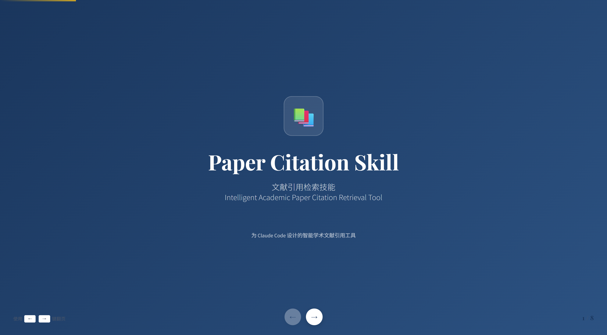
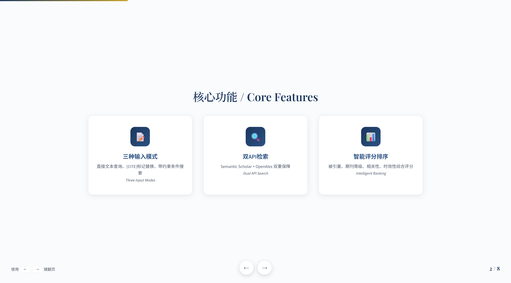
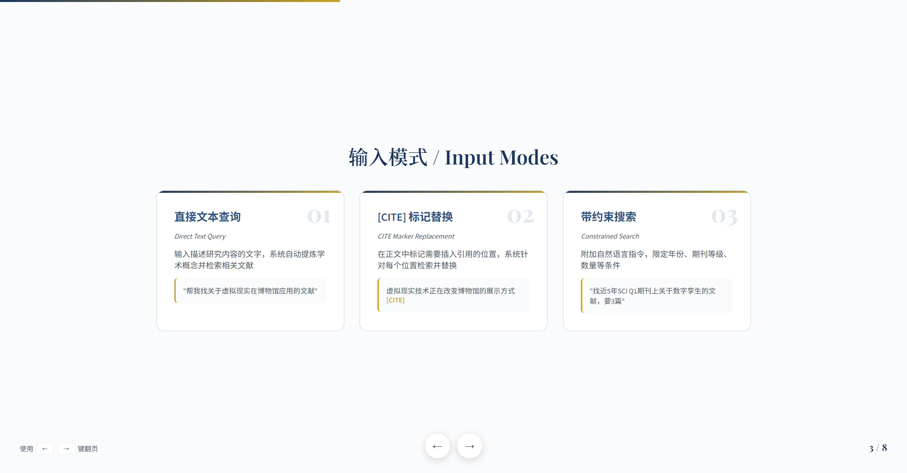
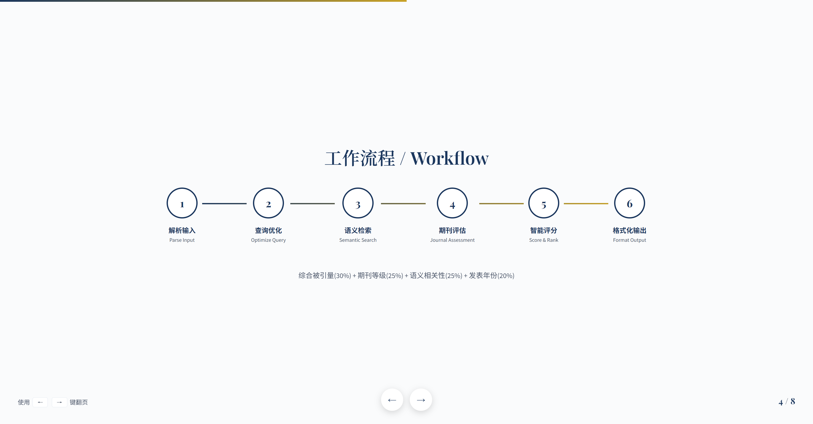
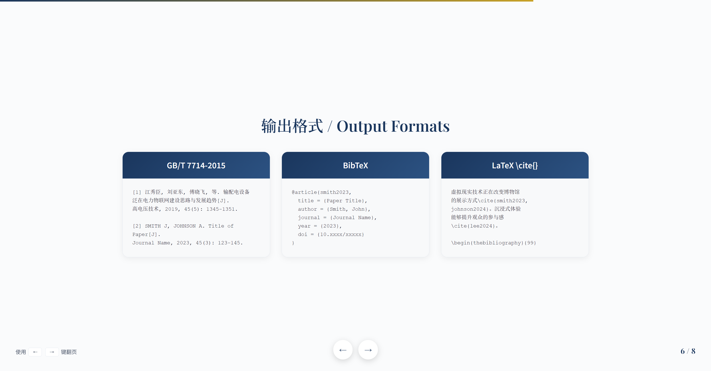
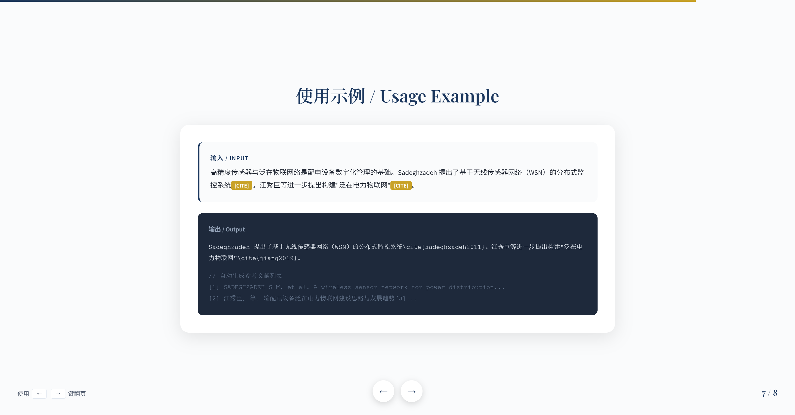
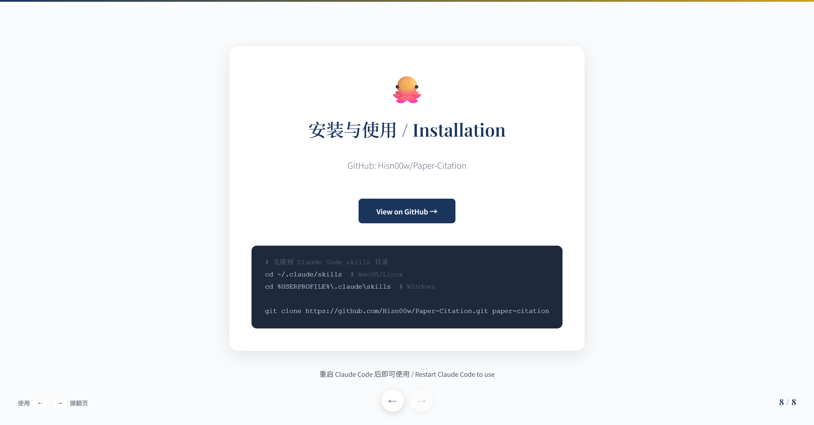

# Paper Citation for Claude Code / Claude Code 文献引用技能

[](LICENSE)
[](https://github.com/Hisn00w/Paper-Citation/stargazers)

**English** | [中文](#中文)

---

## English

An intelligent academic paper citation retrieval skill for [Claude Code](https://claude.ai/code). Supports semantic search, journal quality assessment, and multi-format citation output.

### Features

- **Three Input Modes**: Direct text query, [CITE] marker replacement, constrained search
- **Dual API Search**: Semantic Scholar + OpenAlex for comprehensive coverage
- **Intelligent Ranking**: Considers citation count, journal tier, semantic relevance, and publication year
- **Multi-format Output**: GB/T 7714-2015, BibTeX, LaTeX `\cite{}` formats
- **Journal Rankings**: Built-in rankings for HCI, AI/ML/Deep Learning, LLMs/NLP, Computer Systems, Cyber Security, Design Studies, Cultural Heritage, and Chinese computer journals

### Installation

```bash
# Clone to Claude Code skills directory
cd ~/.claude/skills  # macOS/Linux
cd %USERPROFILE%\.claude\skills  # Windows

git clone https://github.com/Hisn00w/Paper-Citation.git paper-citation
```

Then restart Claude Code.

### Usage Examples

**Direct text query:**
```
Find papers about virtual reality applications in museums
```

**[CITE] marker replacement:**
```
Virtual reality is transforming museum exhibitions[CITE]. Immersive experiences enhance visitor engagement[CITE].
```

**Constrained search:**
```
Find 3 papers on digital twins from SCI Q1 journals in the last 5 years, output BibTeX format
```

### Presentation Slides

Below is an 8-slide presentation showcasing the Paper Citation Skill:

| Slide | Title |
|:-----:|-------|
| 1 | Cover |
| 2 | Features Overview |
| 3 | Input Modes |
| 4 | Workflow |
| 5 | Journal Rankings |
| 6 | Output Formats |
| 7 | Usage Example |
| 8 | Installation |










### Documentation

- [SKILL.md](paper-citation/SKILL.md) - Detailed workflow documentation
- [README.md](paper-citation/README.md) - Full usage guide (Chinese)
- [venue-rankings.md](paper-citation/references/venue-rankings.md) - Journal rankings reference
- [api-reference.md](paper-citation/references/api-reference.md) - API documentation

---

## 中文

适用于 [Claude Code](https://claude.ai/code) 的智能学术文献引用检索技能。支持语义搜索、期刊等级评估和多格式引用输出。

### 功能特点

- **三种输入模式**：直接文本查询、[CITE]标记替换、带约束条件搜索
- **双API检索**：Semantic Scholar + OpenAlex，覆盖更全
- **智能评分**：综合考虑被引量、期刊等级、语义相关性和发表年份
- **多格式输出**：GB/T 7714-2015、BibTeX、LaTeX `\cite{}` 格式
- **期刊等级速查**：内置人机交互、AI/机器学习/深度学习、大语言模型/NLP、计算机系统、网络安全、设计学、文化遗产、中文计算机期刊等领域期刊等级

### 安装

```bash
# 克隆到 Claude Code skills 目录
cd ~/.claude/skills  # macOS/Linux
cd %USERPROFILE%\.claude\skills  # Windows

git clone https://github.com/Hisn00w/Paper-Citation.git paper-citation
```

然后重启 Claude Code。

### 使用示例

**直接文本查询：**
```
帮我找关于虚拟现实在博物馆应用的文献
```

**[CITE]标记替换：**
```
虚拟现实技术正在改变博物馆的展示方式[CITE]。沉浸式体验能够提升观众的参与感[CITE]。
```

**带约束搜索：**
```
找近5年发表在SCI Q1期刊上关于数字孪生的文献，需要3篇，输出BibTeX格式
```

### 文档

- [SKILL.md](paper-citation/SKILL.md) - 详细工作流程文档
- [README.md](paper-citation/README.md) - 完整使用说明
- [venue-rankings.md](paper-citation/references/venue-rankings.md) - 期刊等级参考表
- [api-reference.md](paper-citation/references/api-reference.md) - API接口文档

---

## License

MIT License
